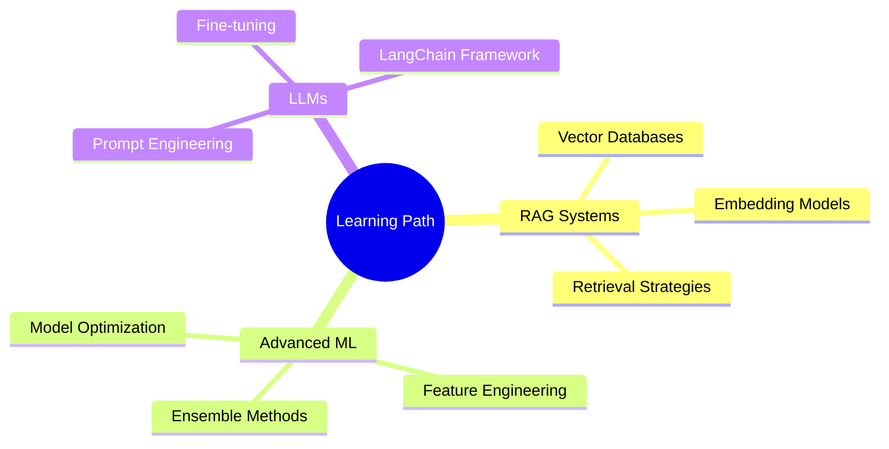

<div align="center">
  
</div>

<div align="center">
  
[+Student;Machine+Learning+Engineer;Data+Analytics+Enthusiast;Building+Real-World+AI+Solutions)](https://git.io/typing-svg)


</div>

---

## 👨‍💻 About Me

```python
class HareshKN:
    def __init__(self):
        self.name = "Haresh K N"
        self.role = "CSE (AIML) Student | Aspiring Data Analyst & AI Engineer"
        self.year = "3rd Year"
        self.interests = ["Machine Learning", "Data Analytics", "Generative AI"]
        self.current_focus = ["RAG Systems", "Advanced ML", "LLMs"]
        self.goal = "Building impactful AI solutions for real-world problems"
    
    def say_hi(self):
        print("Thanks for dropping by! Let's build something amazing together.")

me = HareshKN()
me.say_hi()
```

🎯 **Career Objective:** Passionate about leveraging AI and data to solve complex problems. Seeking opportunities in Data Analytics and AI Engineering roles.

---

## 🚀 Featured Projects

<table>
<tr>
<td width="33%" valign="top">

### 🛡️ Fraud Detection System
Advanced fraud detection using ensemble ML techniques
- **Tech:** LightGBM, Isolation Forest
- **Features:** Real-time anomaly detection
- **Impact:** High accuracy fraud prevention

</td>
<td width="33%" valign="top">

### 🛡️ Cyberbullying Detection
NLP-powered content moderation system
- **Tech:** NLP, Deep Learning
- **Features:** Multi-class classification
- **Impact:** Safer online communities

</td>
<td width="33%" valign="top">

### 🎤 AI Campus Voice Assistant
Multilingual voice-powered campus assistant
- **Tech:** Whisper, GenAI, RAG
- **Features:** Voice recognition, multilingual
- **Impact:** Enhanced campus accessibility

</td>
</tr>
</table>

---

## 🛠️ Tech Stack

### Languages & Core
<p align="left">
  
  
  
</p>

### Data Science & ML
<p align="left">
  
  
  
  
  
</p>

### AI & GenAI
<p align="left">
  
  
  
</p>

### Web & Deployment
<p align="left">
  
  
</p>

### Tools & Version Control
<p align="left">
  
  
  
  
</p>

---

## 📊 GitHub Statistics

<div align="center">
  
  
</div>

<div align="center">
  
</div>

---

## 📈 Contribution Graph

<div align="center">
  
</div>

<div align="center">
  
</div>

---

## 📚 Currently Learning

<div align="center">



</div>

- 🔍 **Retrieval Augmented Generation (RAG)** - Building context-aware AI systems
- 🤖 **Large Language Models (LLMs)** - Fine-tuning and prompt engineering
- 📊 **Advanced ML Techniques** - Ensemble methods and optimization
- 🎯 **MLOps** - Model deployment and monitoring best practices

---

## 🏆 Achievements & Highlights

<div align="center">

| 🎯 Focus Area | 💡 Expertise |
|--------------|-------------|
| Machine Learning | Supervised & Unsupervised Learning, Ensemble Methods |
| Data Analytics | EDA, Statistical Analysis, Data Visualization |
| Generative AI | RAG Systems, LLM Integration, Prompt Engineering |
| NLP | Text Classification, Sentiment Analysis, Language Models |

</div>

---
 
## 📫 Let's Connect

<div align="center">

[](https://linkedin.com/in/haresh-k-n)
[](mailto:hareshkn1501@gmail.com)
[](https://github.com/HARESH1501)
[](https://github.com/HARESH1501)

</div>

---

<div align="center">
  
### 💭 Quote of the Day
  


### ✨ "Turning data into insights, and insights into impact" ✨


</div>
